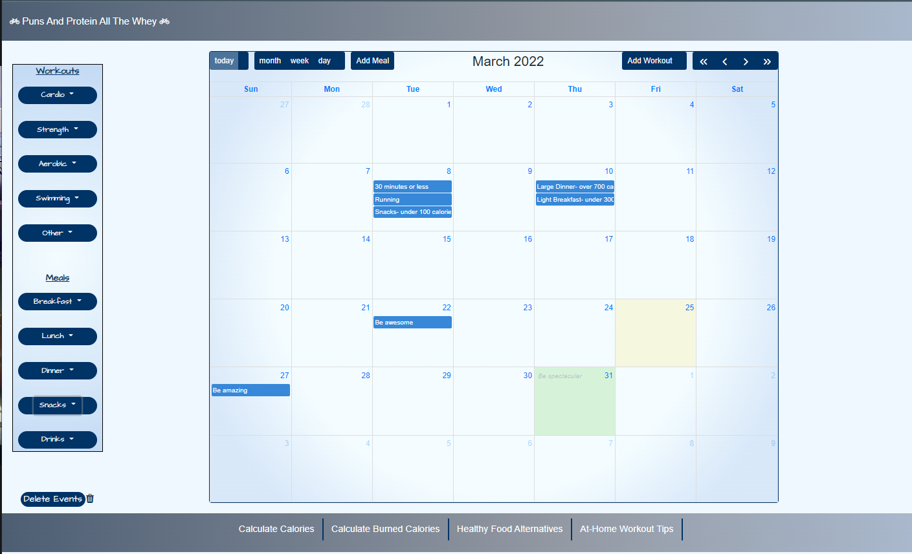

# Project-2- All Pain No Gain

## Overview

Welcome to our Project 2! This is another important milestone in our full-stack journey: designing and building our first full-stack web application. Our team designed and built an app using the MVC paradigm, own server-side API, user authentication, and connection to a database.

## The Work

With our team, we conceived and executed a design that solves a real-world problem. In creating our first collaborative full-stack application, we combined a robust back end--with servers, databases, advanced APIs, and user authentication—-to an intuitive front end. We continued to build on the agile development methodologies we've used throughout this course, like storing our project code in GitHub, managing our work with a project management tool, and implementing feature and bug fixes using the Git branch workflow and pull requests.

## User Story

Whether you're a health fiend, a casual gym-goer and broccoli-eater, or just getting started; we designed an app that will encompass all your health-tracking needs in one spot. This app will inspire you with motivational quotes, help you track your food intake and exercise, offer you calorie counting resources, and provide tips for workouts/eating better.

### General

This app first presents you with our welcome page that has an inspirational quote that is randomly generated with an API. Once you click the "Get Started" button, you are taken to a login/sign-up page that will ask for your credentials. Once submitted, you are directed to the main page. On the main page you will find a side menu, calendar, header, and footer. This side menu has different button options that- once clicked- will dropdown a menu of specific choices pertaining to that category. The user can drag and drop these choices anywhere on the calendar to either mark what they've done, or mark what they will do. This can be used to scehdule their week, track their progress, etc. There are two buttons on the top of the calendar, "Add meal", and "Add workout", that also let the user enter specific data they would like displayed on the calendar that is not listed on the side menu. With all the being said, the user is not limited to just entering meals and workouts on the calendar. They can also click any date on the calendar and enter any kind of input they would like. The footer on the main page contains four links that the user can follow to a calorie counter for food, a calorie tracker for workouts, healthy food alternative suggestions, and tips to get your workout on at home.

## Acceptance Criteria

We are prepared to:

- Speak technically about features we implemented in our project

- Explain and execute git branching workflow in a collaborative project

- Resolve merge conflicts

- Explain agile software development

- Design, build and deploy a full-stack web application to Heroku

- Present a professional presentation and repository README for our project

## Review

We are submitting the following for review:

- The URL of the Heroku page: [All Pain No Grain - Site](https://gentle-everglades-97970.herokuapp.com/)

- The URL of the GitHub repository:
  https://github.com/alexgeis/All-Pain-No-Gain

- Contributors:
  Alex Geis
  Maria Paterno
  Brenden Holt
  Gavin Wentzel

- Screenshots:

## Copyright

Copyright (c) 2021 Adam Shaw

Permission is hereby granted, free of charge, to any person obtaining
a copy of this software and associated documentation files (the
"Software"), to deal in the Software without restriction, including
without limitation the rights to use, copy, modify, merge, publish,
distribute, sublicense, and/or sell copies of the Software, and to
permit persons to whom the Software is furnished to do so, subject to
the following conditions:

The above copyright notice and this permission notice shall be
included in all copies or substantial portions of the Software.

THE SOFTWARE IS PROVIDED "AS IS", WITHOUT WARRANTY OF ANY KIND,
EXPRESS OR IMPLIED, INCLUDING BUT NOT LIMITED TO THE WARRANTIES OF
MERCHANTABILITY, FITNESS FOR A PARTICULAR PURPOSE AND
NONINFRINGEMENT. IN NO EVENT SHALL THE AUTHORS OR COPYRIGHT HOLDERS BE
LIABLE FOR ANY CLAIM, DAMAGES OR OTHER LIABILITY, WHETHER IN AN ACTION
OF CONTRACT, TORT OR OTHERWISE, ARISING FROM, OUT OF OR IN CONNECTION
WITH THE SOFTWARE OR THE USE OR OTHER DEALINGS IN THE SOFTWARE.
